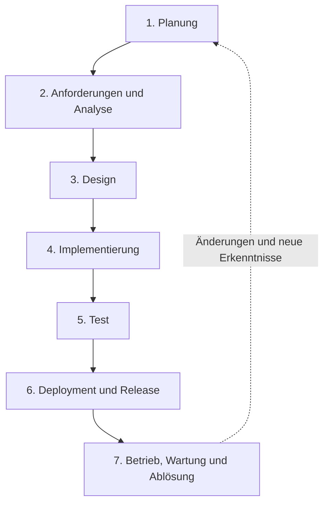
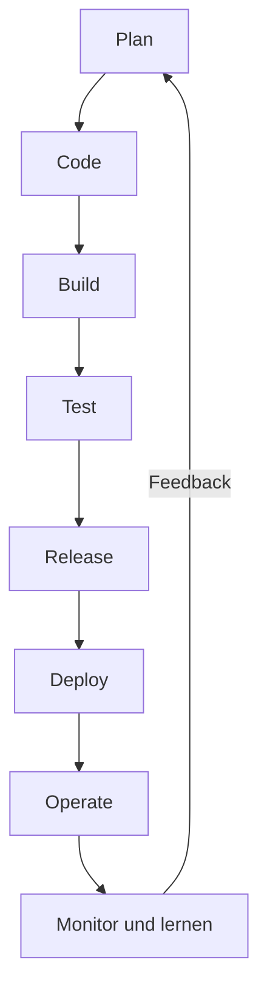
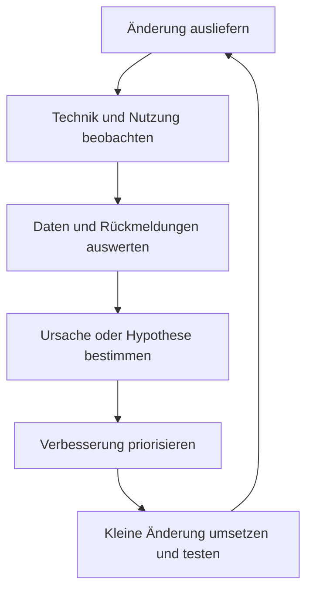
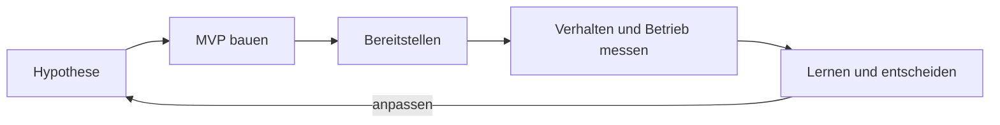
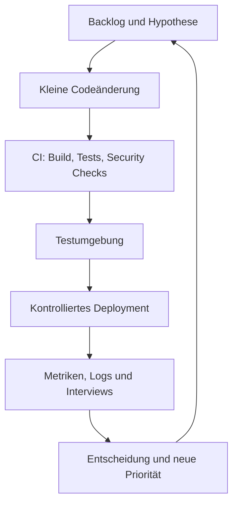

# DevOps-Prozesse: SDLC, DevOps Lifecycle und MVP

**Lernauftrag M324**  
**Stand:** 24. August 2026  
**Name:** Ramis und Lukas

---

## Inhaltsverzeichnis

1. [Überblick](#1-überblick)
2. [Grundlagen](#2-grundlagen)
3. [Bearbeitung des Auftrags](#3-bearbeitung-des-auftrags)
   1. [SDLC](#31-was-ist-der-sdlc)
   2. [DevOps Lifecycle](#32-was-ist-der-devops-lifecycle)
   3. [Unterschiede und Auswirkungen](#33-sdlc-und-devops-lifecycle-im-vergleich)
   4. [MVP im DevOps Lifecycle](#34-was-ist-ein-mvp-und-welche-bedeutung-hat-es-im-devops-lifecycle)
4. [Lernziele im Detail](#4-lernziele-im-detail)
5. [Transfer in ein realistisches Projekt](#5-transfer-in-ein-realistisches-projekt)
6. [Zusammenfassung](#6-zusammenfassung)
7. [Quellenverzeichnis](#9-quellenverzeichnis)
8. [KI-Nachweis](#10-ki-nachweis)

---

# 1. Überblick

## Worum geht es?

Software entsteht nicht nur beim Programmieren. Vor dem ersten Code müssen ein Problem verstanden, Anforderungen geklärt und eine Lösung entworfen werden. Nach dem Programmieren folgen Tests, Bereitstellung und Betrieb. Später werden Fehler behoben, Sicherheitslücken geschlossen und neue Anforderungen umgesetzt.

Der **Software Development Life Cycle (SDLC)** ordnet diese Arbeit in nachvollziehbare Phasen. Der **DevOps Lifecycle** betrachtet dieselbe Wertschöpfung als fortlaufenden Kreislauf, in dem Entwicklung (**Development**) und Betrieb (**Operations**) gemeinsam Verantwortung tragen. Ein **Minimum Viable Product (MVP)** hilft dabei, eine wichtige Annahme früh mit einer kleinen, aber brauchbaren Produktversion zu überprüfen.

## Warum ist das relevant?

Ohne einen geregelten Lebenszyklus entstehen leicht Missverständnisse, ungetestete Änderungen, unsichere Systeme und teure Nacharbeiten. Eine gute Vorgehensweise sorgt dafür, dass:

- das Team das richtige Problem löst,
- Qualität und Sicherheit nicht erst am Schluss geprüft werden,
- Software reproduzierbar bereitgestellt werden kann,
- Rückmeldungen aus Nutzung und Betrieb in neue Entscheidungen einfliessen,
- und Verbesserungen nicht vom Zufall abhängen.

## Behandelte Lernziele

Nach der Bearbeitung kann eine lernende Person:

1. SDLC und DevOps Lifecycle in eigenen Worten erklären;
2. beide Sichtweisen differenziert vergleichen;
3. die stärkere Einbindung von Feedback, Betrieb und kontinuierlicher Verbesserung in DevOps begründen;
4. ein MVP als Lern- und Feedbackinstrument einordnen;
5. Quellenmodelle kritisch vergleichen und daraus eine eigene Schlussfolgerung ableiten.

> **Zentrale Aussage:** SDLC und DevOps sind keine zwingenden Gegensätze. Der SDLC beschreibt, **welche Lebensphasen** Software durchläuft. DevOps beschreibt vor allem, **wie diese Arbeit kontinuierlich, gemeinsam, automatisiert und datenbasiert organisiert wird**.

---

# 2. Grundlagen

## 2.1 Zentrale Begriffe

| Begriff | Einfache Erklärung |
|---|---|
| **Lebenszyklus** | Alle Stationen eines Produkts von der Idee bis zur Ausserbetriebnahme. |
| **Development (Dev)** | Planung, Entwurf, Programmierung und Test der Software. |
| **Operations (Ops)** | Bereitstellung, Betrieb, Überwachung, Support und Wiederherstellung eines Systems. |
| **Produktion** | Die reale Umgebung, in der die Endnutzerinnen und Endnutzer das System verwenden. |
| **Deployment** | Technisches Übertragen einer Softwareversion in eine Zielumgebung. Eine Bereitstellung muss nicht automatisch bedeuten, dass die Funktion sofort für alle sichtbar ist. |
| **Release** | Fachliche Freigabe einer Version oder Funktion für Nutzerinnen und Nutzer. Feature Flags können Deployment und Release zeitlich trennen. |
| **Iteration** | Ein kurzer Arbeitsdurchlauf, nach dem ein überprüfbares Ergebnis vorliegt und verbessert werden kann. |
| **Feedback Loop** | Rückkopplung: Ein Ergebnis wird beobachtet, bewertet und zur Anpassung des nächsten Schritts verwendet. |
| **CI** | **Continuous Integration**: Kleine Codeänderungen werden häufig zusammengeführt und automatisch gebaut und getestet. |
| **CD** | **Continuous Delivery** hält Änderungen jederzeit auslieferbar. **Continuous Deployment** geht weiter und bringt bestandene Änderungen automatisch in Produktion. |
| **Pipeline** | Automatisierte Abfolge, beispielsweise Code prüfen, bauen, testen, Sicherheitsprüfung durchführen und bereitstellen. |
| **Monitoring** | Laufendes Beobachten bekannter Messwerte, beispielsweise Fehlerrate, Antwortzeit und Verfügbarkeit. |
| **Observability** | Fähigkeit, den inneren Zustand eines Systems mithilfe von Metriken, Logs und Traces zu verstehen, auch bei zuvor unbekannten Problemen. |
| **Infrastructure as Code (IaC)** | Infrastruktur wird durch versionierten Code beschrieben und reproduzierbar erstellt, statt manuell zusammengeklickt zu werden. |

## 2.2 Drei Begriffe, die nicht verwechselt werden sollten

| Begriff | Hauptfrage | Schwerpunkt |
|---|---|---|
| **SDLC** | Welche Schritte braucht Software über ihren Lebenszyklus? | Struktur und Steuerung |
| **Agile** | Wie reagieren wir während der Entwicklung schnell auf Änderungen? | Kurze Iterationen, Zusammenarbeit und Anpassung |
| **DevOps** | Wie verbinden wir Entwicklung, Lieferung und Betrieb zu einem schnellen, zuverlässigen Lernsystem? | Gemeinsame Verantwortung, Automatisierung, Betrieb und Feedback |

Agile und DevOps können einen SDLC prägen. Agile endet gedanklich häufig bei einem nutzbaren Produktinkrement; DevOps bindet zusätzlich Lieferung und laufenden Betrieb besonders stark ein. Das Agile Manifest betont funktionierende Software, Zusammenarbeit mit Kundinnen und Kunden und das Reagieren auf Veränderungen.[^agile-manifesto]

---

# 3. Bearbeitung des Auftrags

## 3.1 Was ist der SDLC?

Der **Software Development Life Cycle** ist ein strukturierter Rahmen für die Planung, Entwicklung, Bereitstellung, Pflege und schliesslich Ablösung von Software. Er zerlegt ein komplexes Vorhaben in kontrollierbare Abschnitte mit Zielen, Aufgaben und Ergebnissen.

AWS beschreibt den SDLC als planbaren Prozess, der Risiken verringern und hochwertige Software effizient hervorbringen soll.[^aws-sdlc] IBM betont zusätzlich, dass die Phasen wiederholbar und voneinander abhängig sind und je nach Vorgehensmodell nacheinander oder iterativ bearbeitet werden können.[^ibm-sdlc]

### 3.1.1 Die Phasen des SDLC

Es gibt keine weltweit verbindliche Anzahl von Phasen. AWS verwendet sechs Hauptphasen, während IBM Planung und Analyse trennt und dadurch sieben nennt. Inhaltlich passen die Modelle weitgehend zusammen. Für diesen Lernauftrag wird deshalb das folgende siebenteilige Modell verwendet:

| Phase | Zentrale Frage | Typische Tätigkeiten | Typisches Ergebnis | Beitrag zum Erfolg |
|---|---|---|---|---|
| **1. Planung** | Warum soll das Projekt durchgeführt werden? | Problem, Ziele, Nutzen, Umfang, Stakeholder, Budget, Zeit, Machbarkeit und Risiken klären | Projektauftrag, grober Plan, Business Case | Verhindert, dass ohne klares Ziel investiert wird. |
| **2. Anforderungen und Analyse** | Was muss das System leisten? | Nutzerbedürfnisse, funktionale und nichtfunktionale Anforderungen, Akzeptanzkriterien und Randbedingungen erheben | Spezifikation oder priorisiertes Backlog | Schafft ein gemeinsames Verständnis dessen, was „fertig“ bedeutet. |
| **3. Design** | Wie soll die Lösung aufgebaut sein? | Architektur, Datenmodell, Schnittstellen, Benutzerführung, Technologien, Sicherheits- und Betriebskonzept entwerfen | Architekturentscheidungen, Modelle, Prototypen, Teststrategie | Reduziert technische Risiken, bevor viel Code entsteht. |
| **4. Implementierung** | Wie wird der Entwurf zu funktionierender Software? | Code schreiben, Code Reviews, Unit Tests, Versionsverwaltung und Dokumentation | Lauffähige Softwarebausteine | Setzt Anforderungen kontrolliert in ein Produkt um. |
| **5. Test** | Erfüllt die Software die Anforderungen zuverlässig und sicher? | Integrations-, System-, Akzeptanz-, Sicherheits- und Leistungstests | Testberichte, Fehlerkorrekturen, Freigabeentscheid | Findet Abweichungen, bevor sie Nutzerinnen und Nutzer treffen. |
| **6. Deployment und Release** | Wie gelangt die geprüfte Version sicher zu den Nutzenden? | Paketierung, Konfiguration, Datenmigration, Rollout, Freigabe und Rückfallplan | Verfügbare Version in der Zielumgebung | Macht den geschaffenen Nutzen tatsächlich zugänglich. |
| **7. Betrieb, Wartung und Ablösung** | Wie bleibt das System nutzbar, sicher und wirtschaftlich? | Überwachen, Support, Fehlerbehebung, Updates, Kapazitätsplanung, Backups, Incident Management und spätere Stilllegung | Stabiles System, Verbesserungen oder geordnete Ablösung | Sichert den Nutzen über die gesamte Lebensdauer. |

Sicherheit sollte nicht erst in der Testphase beginnen. NIST stellt fest, dass viele SDLC-Modelle Sicherheit nicht ausreichend detaillieren, und empfiehlt deshalb, sichere Entwicklungspraktiken in jede konkrete SDLC-Umsetzung zu integrieren.[^nist-ssdf]

### 3.1.2 Wie wird der SDLC in einem Projekt angewendet und gesteuert?

Ein Projekt übernimmt nicht nur die Phasenbezeichnungen. Es legt für jede Phase fest:

- **Verantwortung:** Wer entscheidet, erstellt, prüft und genehmigt?
- **Eingaben und Ergebnisse:** Welche Unterlagen oder Softwareartefakte werden benötigt und geliefert?
- **Qualitätskriterien:** Welche Definition of Done und Akzeptanzkriterien gelten?
- **Risiken und Kontrollen:** Welche technischen, fachlichen, rechtlichen und sicherheitsbezogenen Risiken müssen behandelt werden?
- **Änderungsweg:** Wie gelangen neue Erkenntnisse in Anforderungen, Design und Planung zurück?
- **Messung:** Woran erkennt das Team Fortschritt, Qualität und Nutzen?

Typische Steuerungsinstrumente sind Backlog oder Anforderungskatalog, Zeit- und Releaseplan, Risikoliste, Architekturentscheidungen, Versionsverwaltung, Testnachweise, Reviews, Freigaben und Betriebskennzahlen.

Das gewählte **SDLC-Modell** bestimmt, wie die Phasen durchlaufen werden:

| Modell | Ablauf | Sinnvoll, wenn … | Zentrale Grenze |
|---|---|---|---|
| **Wasserfall** | Phasen überwiegend nacheinander | Anforderungen stabil und Freigaben stark geregelt sind | Späte Änderungen sind teuer; reales Nutzerfeedback kommt oft spät. |
| **V-Modell** | Entwicklungsstufen werden passenden Teststufen zugeordnet | Nachweisbarkeit und systematische Verifikation wichtig sind | Bleibt bei Änderungen relativ schwerfällig. |
| **Iterativ/agil** | Kleine Teile werden wiederholt geplant, gebaut, getestet und bewertet | Anforderungen sich verändern oder erst durch Nutzung klar werden | Benötigt Priorisierung, häufiges Feedback und disziplinierte Qualitätssicherung. |
| **Spiralmodell** | Wiederholte Zyklen mit ausdrücklicher Risikoanalyse | Ein Vorhaben neuartig, teuer oder besonders risikoreich ist | Höherer Steuerungsaufwand. |

> **Merksatz:** Der SDLC gibt Orientierung. Das gewählte Prozessmodell legt fest, ob seine Phasen linear, überlappend oder wiederholt stattfinden.

### 3.1.3 Quellenabgleich zu Thema 1

| Quelle | Darstellung | Einordnung |
|---|---|---|
| AWS[^aws-sdlc] | 6 Phasen: Plan, Design, Implement, Test, Deploy, Maintain | Anforderungen sind in „Plan“ enthalten. Gut als kompakter Einstieg. |
| IBM[^ibm-sdlc] | 7 Phasen: Planning, Analysis, Design, Coding, Testing, Deployment, Maintenance | Trennt Planung und Anforderungsanalyse. Dadurch didaktisch detaillierter. |
| NIST[^nist-ssdf] | Keine alternative Phasenliste, sondern Sicherheitspraktiken für jede SDLC-Umsetzung | Ergänzt eine Lücke der allgemeinen Modelle und zeigt, dass Sicherheit phasenübergreifend behandelt werden muss. |

**Eigene Schlussfolgerung:** Die unterschiedliche Zahl der Phasen ist kein sachlicher Widerspruch, sondern eine andere Granularität. Entscheidend sind nicht die Namen, sondern klare Ziele, Ergebnisse, Verantwortlichkeiten und Rückkopplungen über den gesamten Lebenszyklus.

---

## 3.2 Was ist der DevOps Lifecycle?

**DevOps** verbindet Development und Operations durch gemeinsame Kultur, Prozesse und Werkzeuge. Entwicklung, Qualitätssicherung, Security und Betrieb arbeiten nicht als isolierte Stationen, sondern als gemeinsames System. Microsoft fasst den Anwendungslebenszyklus in **Planung, Entwicklung, Lieferung und Betrieb** zusammen.[^ms-devops] AWS definiert DevOps als Verbindung von Kultur, Praktiken und Werkzeugen, die schnelle und zugleich zuverlässige Lieferung und Verbesserung ermöglichen soll.[^aws-devops]

DevOps ist deshalb **nicht nur eine Tool-Sammlung** und auch **nicht bloss eine CI/CD-Pipeline**. Automatisierung ist ein Mittel. Das Ziel ist ein schneller, sicherer Fluss von einer Idee bis zu messbarem Nutzen und wieder zurück zu neuen Entscheidungen.

### 3.2.1 Struktur und Kernphasen

Die vier Microsoft-Makrophasen können für die praktische Arbeit feiner aufgeteilt werden:

**Sicherheit, Zusammenarbeit und Automatisierung wirken durch alle Phasen.**

| Phase | Was geschieht? | Typische Rückmeldung |
|---|---|---|
| **Plan** | Nutzerproblem, Hypothesen, Anforderungen, Risiken und kleine Arbeitspakete priorisieren | Interviews, Supportfälle, Nutzungsdaten, Geschäftsziele |
| **Code** | Kleine Änderungen entwickeln, versionieren und gegenseitig prüfen | Code Review, statische Analyse, lokale Tests |
| **Build** | Quellcode reproduzierbar in ein ausführbares Artefakt umwandeln | Build-Status, Abhängigkeits- und Lizenzprüfung |
| **Test** | Funktion, Integration, Sicherheit und Leistung automatisch und gezielt manuell prüfen | Testergebnisse und Qualitätsgrenzen |
| **Release** | Eine geprüfte Version kennzeichnen, dokumentieren und zur Freigabe vorbereiten | Freigabeprüfung und Release Notes |
| **Deploy** | Änderung automatisiert und kontrolliert in eine Umgebung bringen | Deployment-Status, Smoke Tests, Rollback-Signal |
| **Operate** | Verfügbarkeit, Sicherheit, Kapazität, Support und Störungen gemeinsam verantworten | Incidents, Supporttickets, Service-Level-Werte |
| **Monitor und lernen** | Metriken, Logs, Traces und Nutzerverhalten auswerten | Verbesserungen, neue Hypothesen und priorisierte Backlog-Einträge |

Die genaue Phasenzahl variiert je nach Quelle. Das ist beim DevOps Lifecycle besonders nachvollziehbar: „Build“ und „Test“ können etwa als Teil von „Develop“ betrachtet werden. Wichtig ist der **geschlossene Kreislauf**, nicht eine bestimmte Grafik.

### 3.2.2 Zentrale Praktiken

- **Gemeinsame Verantwortung:** Entwicklung und Betrieb optimieren gemeinsam Nutzen, Qualität und Zuverlässigkeit. Microsoft nennt ausdrücklich eine Verantwortung über die traditionellen Rollengrenzen hinweg.[^ms-devops]
- **Kleine Änderungen:** Kleine Arbeitspakete lassen sich schneller prüfen, ausliefern, beobachten und bei Problemen zurücknehmen.
- **CI/CD:** Wiederholbare Builds, Tests und Deployments verkürzen Wartezeiten und reduzieren manuelle Fehler.
- **Versionsverwaltung:** Code, Konfiguration und möglichst auch Infrastrukturänderungen sind nachvollziehbar.
- **Automatisierte Qualität und Sicherheit:** Tests, Abhängigkeitsprüfungen und Security Scans liefern früh Rückmeldung.
- **Observability:** Produktionsdaten zeigen, ob ein System technisch funktioniert und wie sich Änderungen tatsächlich auswirken.
- **Kontinuierliches Lernen:** Feedback verändert Backlog, Architektur, Tests und Arbeitsweise. AWS empfiehlt ausdrücklich, Observability-Daten für iterative Verbesserungen zu verwenden.[^aws-observability]

### 3.2.3 Ziele gegenüber traditionellen Entwicklungsansätzen

| Ziel | Mechanismus im DevOps Lifecycle | Erwartete Wirkung |
|---|---|---|
| **Kürzere Time to Market** | Kleine Änderungen, gemeinsame Abläufe und automatisierte Pipeline | Wert erreicht Nutzende schneller. |
| **Häufigere, sichere Lieferung** | Automatische Tests, standardisierte Deployments und kleine Batches | Weniger Risiko pro Änderung und leichterer Rollback. |
| **Höhere Zuverlässigkeit** | Monitoring, Betriebsverantwortung und schnelle Wiederherstellung | Probleme werden schneller erkannt und behoben. |
| **Bessere Anpassung an Bedürfnisse** | Kurze Feedback Loops aus Nutzung, Support und Experimenten | Fehlannahmen werden früher korrigiert. |
| **Weniger Übergabeverluste** | Gemeinsame Ziele und Verantwortung statt Abteilungssilos | Weniger Wartezeit und Missverständnisse. |
| **Kontinuierliche Verbesserung** | Messen, reflektieren, priorisieren, ändern und erneut messen | Produkt und Arbeitsprozess entwickeln sich fortlaufend weiter. |

### 3.2.4 Wie lässt sich Verbesserung messen?

Die DORA-Forschung führt aktuell fünf Kennzahlen für Softwarelieferleistung auf.[^dora-metrics] Sie sollen im Kontext eines konkreten Dienstes über die Zeit betrachtet und nicht als isolierte Rangliste missbraucht werden.

| Bereich | Kennzahl | Aussage |
|---|---|---|
| Durchsatz | **Change Lead Time** | Zeit vom Commit bis zur produktiven Bereitstellung |
| Durchsatz | **Deployment Frequency** | Häufigkeit produktiver Deployments |
| Durchsatz/Wiederherstellung | **Failed Deployment Recovery Time** | Zeit bis zur Erholung nach einem fehlgeschlagenen Deployment |
| Instabilität | **Change Fail Rate** | Anteil der Deployments, die sofortige Korrektur benötigen |
| Instabilität | **Deployment Rework Rate** | Anteil ungeplanter Deployments als Folge eines Produktionsvorfalls |

Diese Werte erklären die Lieferleistung, aber nicht allein den Produkterfolg. Zusätzlich braucht es beispielsweise Nutzerzufriedenheit, Nutzungsrate, fachliche Erfolgsquote, Verfügbarkeit, Kosten und Sicherheitsindikatoren.

> **Merksatz:** DevOps optimiert nicht nur Geschwindigkeit. Es verbindet Geschwindigkeit mit Stabilität, Lernfähigkeit und gemeinsamer Verantwortung.

### 3.2.5 Quellenabgleich zu Thema 2

| Quelle | Schwerpunkt | Einordnung |
|---|---|---|
| Microsoft[^ms-devops] | Vier Makrophasen, Teamkultur, gemeinsame Verantwortung und kontinuierliche Wertlieferung | Sehr gut für das Gesamtbild und die organisatorische Seite. |
| AWS[^aws-devops] | Kultur, Praktiken, Werkzeuge, Automatisierung, Geschwindigkeit und Zuverlässigkeit | Bestätigt, dass DevOps mehr als CI/CD ist. |
| AWS DevOps Guidance[^aws-dev-lifecycle] | Sichere Lieferung durch Feedback Loops und wiederholbare Deployments | Konkretisiert die technische Umsetzung. |
| DORA[^dora-metrics] | Forschungsbasierte Messung von Durchsatz und Instabilität | Ergänzt Definitionen um überprüfbare Ergebniskennzahlen. |

**Eigene Schlussfolgerung:** Die Quellen verwenden unterschiedliche Phasenmodelle, stimmen aber bei den Grundprinzipien überein: Zusammenarbeit, Automatisierung, kurze Lieferzyklen, Betriebserkenntnisse und kontinuierliches Lernen.

---

## 3.3 SDLC und DevOps Lifecycle im Vergleich

### 3.3.1 Die wichtigste fachliche Abgrenzung

Ein häufiger Fehler lautet: „SDLC ist linear und DevOps ist zyklisch.“ Das ist zu pauschal. IBM beschreibt ausdrücklich sowohl sequenzielle als auch iterative SDLC-Modelle.[^ibm-sdlc] Korrekt ist:

- **SDLC** ist ein allgemeiner Ordnungsrahmen. Er kann als Wasserfall, V-Modell, iterativ oder agil umgesetzt werden.
- **DevOps** ist eine konkrete kulturelle und technische Sichtweise, die diese Lebenszyklusarbeit als kontinuierlichen Wert- und Feedbackfluss organisiert.
- Gegenübergestellt wird daher sinnvollerweise eine **traditionell sequenzielle und siloartige SDLC-Umsetzung** mit einer **DevOps-Umsetzung**, nicht „jeder SDLC“ mit DevOps.

IBM formuliert den Zusammenhang ähnlich: DevOps ordnet SDLC-Schritte zu einem kontinuierlichen Zyklus neu, ist aber zugleich grösser als ein einzelnes Prozessmodell, weil Kultur und gemeinsame Verantwortung dazugehören.[^ibm-sdlc]

### 3.3.2 Gegenüberstellung

| Aspekt | SDLC als allgemeiner Rahmen | DevOps Lifecycle |
|---|---|---|
| **Hauptzweck** | Softwareentwicklung über ihren Lebenszyklus strukturieren und kontrollieren | Kontinuierlich, schnell und zuverlässig Wert liefern und aus Betrieb lernen |
| **Art** | Phasen- und Managementrahmen | Kultur, Arbeitsweise, Praktiken und Werkzeuge |
| **Ablaufform** | Vom gewählten Modell abhängig: linear bis iterativ | Bewusst als fortlaufender Kreislauf mit kurzen Feedback Loops |
| **Phasen** | Häufig Planung, Analyse, Design, Entwicklung, Test, Deployment, Wartung | Häufig Plan, Code, Build, Test, Release, Deploy, Operate, Monitor |
| **Teamstruktur** | Kann spezialisierte, getrennte Zuständigkeiten enthalten | Bevorzugt funktionsübergreifende Zusammenarbeit und geteilte Verantwortung |
| **Übergaben** | Bei traditioneller Umsetzung oft formale Übergabe zwischen Abteilungen | Gemeinsamer Workflow reduziert Übergaben und Wartezeiten |
| **Automatisierung** | Möglich, aber nicht durch die Definition erzwungen | Kernmechanismus für Build, Test, Security, Deployment und Infrastruktur |
| **Betrieb** | Meist als Wartungs- oder Betriebsphase enthalten | Von Beginn an Teil von Design, Entwicklung und Erfolgsmessung |
| **Feedback** | Vorhanden, Stärke und Geschwindigkeit hängen vom Modell ab | Mehrere kurze technische, betriebliche und fachliche Feedback Loops |
| **Änderungsumfang** | In sequenziellen Modellen oft grössere Releasepakete | Bevorzugt kleine, häufige und reversible Änderungen |
| **Erfolgsmessung** | Umfang, Termin, Budget, Qualität und Abnahme | Zusätzlich Fluss, Zuverlässigkeit, Wiederherstellung, Nutzung und Lernen |
| **Sicherheit** | Muss bewusst in alle Phasen eingebaut werden | Wird bei DevSecOps automatisiert und als gemeinsame Aufgabe integriert |

### 3.3.3 Auswirkungen auf Entwicklung, Bereitstellung und Betrieb

| Bereich | Traditionell sequenziell und siloartig | DevOps-orientiert |
|---|---|---|
| **Entwicklung** | Längere Arbeitsblöcke und spätere Integration können Konflikte und Fehlannahmen spät sichtbar machen. | Kleine Änderungen und CI geben rasch Rückmeldung zu Build, Tests und Codequalität. |
| **Bereitstellung** | Seltene, grosse und teilweise manuelle Releases sind schwerer zu prüfen und zurückzunehmen. | Standardisierte Pipeline und kleine Deployments machen Änderungen reproduzierbarer und leichter rückgängig. |
| **Betrieb** | Ein separates Betriebsteam erhält das Produkt möglicherweise erst spät und mit Wissensverlust. | Betriebsanforderungen und Observability werden früh entworfen; das Team verfolgt die Wirkung seiner Änderungen. |
| **Fehlerbehebung** | Lange Übergabewege erschweren Ursachenanalyse und Wiederherstellung. | Gemeinsame Telemetrie und Verantwortung verkürzen Erkennung und Reaktion. |
| **Produktentscheidung** | Nutzerfeedback kann erst nach einem grossen Release eintreffen. | Frühe Releases und Experimente liefern Daten für die nächste Priorisierung. |

DevOps beseitigt Risiken nicht automatisch. Eine schlechte Pipeline automatisiert nur einen schlechten Prozess. Häufige Deployments ohne geeignete Tests, Sicherheitskontrollen, Observability und Rückfallstrategie können sogar schneller Schaden verursachen.

### 3.3.4 Warum sind Feedback, Betrieb und Verbesserung in DevOps stärker integriert?

#### 1. Produktion liefert Wissen, das vorab nicht vollständig verfügbar ist

Tests können viele Fehler finden, aber nicht jedes reale Nutzungsmuster, jede Lastspitze und jede Kombination von Umgebungseinflüssen vorhersagen. Betrieb erzeugt echte Daten über Antwortzeiten, Fehler, Nutzung, Supportbedarf und fachliche Wirkung.

#### 2. Gemeinsame Verantwortung schliesst den Informationskreis

Wenn die entwickelnden Personen auch Betriebsqualität und Auswirkungen ihrer Änderungen sehen, gelangt Wissen direkt zurück in Design, Tests und Planung. Weniger Übergaben bedeuten weniger Informationsverlust.

#### 3. Automatisierung verkürzt die Reaktionszeit

Automatische Builds und Tests liefern innerhalb von Minuten technische Rückmeldung. Automatisierte Deployments und Rollbacks verkürzen den Weg von einer Korrektur bis zur Produktion. AWS verbindet höhere Deployment-Frequenz ausdrücklich mit schnelleren Feedback Loops, weist aber zugleich auf die notwendige Balance mit Stabilität hin.[^aws-cd-metrics]

#### 4. Kleine Änderungen machen Lernen günstiger

Bei einer kleinen Änderung ist leichter erkennbar, was einen Effekt verursacht hat. Ein Fehler betrifft weniger neue Funktionen gleichzeitig und eine Korrektur ist einfacher. Auch DORA empfiehlt kleine Änderungspakete, weil sie schneller zu verstehen, zu liefern und wiederherzustellen sind.[^dora-metrics]

#### 5. Verbesserung wird als wiederholbarer Prozess organisiert

Das Team sammelt Daten nicht nur, sondern wandelt sie in Handlungen um:

#### Vier Feedback-Ebenen

| Feedback-Ebene | Beispiel | Typische Geschwindigkeit | Folge |
|---|---|---|---|
| **Code** | Unit Test oder Linter schlägt fehl | Sekunden bis Minuten | Code sofort korrigieren |
| **Lieferung** | Deployment oder Smoke Test scheitert | Minuten | Stoppen, Rollback oder Pipeline korrigieren |
| **Betrieb** | Fehlerrate oder Antwortzeit steigt | Minuten bis Stunden | Incident behandeln und Ursache beseitigen |
| **Produkt/Nutzung** | Funktion wird kaum genutzt oder löst das Problem nicht | Tage bis Wochen | Hypothese, UX oder Prioritäten anpassen |

> **Eigene Schlussfolgerung:** Betrieb ist im DevOps Lifecycle nicht das Ende der Entwicklung, sondern ein Messinstrument. Seine Daten starten die nächste Verbesserung.

---

## 3.4 Was ist ein MVP und welche Bedeutung hat es im DevOps Lifecycle?

### 3.4.1 Definition

Ein **Minimum Viable Product** ist die kleinste geeignete Produktversion, mit der eine wichtige Annahme über Nutzerinnen, Nutzer oder Geschäftswert unter realistischen Bedingungen überprüft werden kann. Eric Ries stellt dabei **validiertes Lernen mit möglichst geringem Aufwand** in den Mittelpunkt.[^ries-mvp] Die Agile Alliance ergänzt, dass beobachtbares Verhalten verlässlicher sein kann als die blosse Frage, was jemand angeblich verwenden würde.[^agile-mvp]

Die drei Wörter bedeuten:

- **Minimum:** Nur der kleinste Umfang, der für den geplanten Lerntest notwendig ist.
- **Viable:** Nutzbar, glaubwürdig und sicher genug, damit das Ergebnis aussagekräftig ist.
- **Product:** Etwas, mit dem die Zielgruppe tatsächlich interagieren kann. Je nach Hypothese kann dies eine sehr einfache digitale Lösung oder ein teilweise manuell erbrachter Service sein.

Ein MVP ist **nicht einfach ein unfertiges Produkt** und nicht automatisch die erste billige Version. Microsoft betont in einem an Unternehmensanwendungen gerichteten Leitfaden, dass ein MVP echten Wert liefern, produktionsreif sein und schnelle Anpassungen ermöglichen soll.[^ms-mvp] Wie weit „produktionsreif“ gehen muss, hängt vom Risiko und Kontext ab: Für Bankdaten oder Medizinsoftware liegt die unverzichtbare Qualitäts- und Sicherheitsgrenze deutlich höher als für einen internen, begrenzten Versuch.

### 3.4.2 Kernmerkmale eines guten MVP

Ein gutes MVP besitzt:

1. **eine konkrete Zielgruppe**;
2. **ein klar beschriebenes Problem**;
3. **eine überprüfbare Hypothese**;
4. **einen kleinen, aber zusammenhängenden Nutzen**;
5. **vorab definierte Messgrössen und Erfolgskriterien**;
6. **genügende Qualität, Datenschutz und Sicherheit für den Einsatzkontext**;
7. **einen Weg zu qualitativer Rückmeldung**, beispielsweise Interviews oder Support;
8. **eine Architektur und Pipeline, die Änderungen ermöglicht**;
9. **eine echte Entscheidung nach dem Test:** weiterentwickeln, verändern oder stoppen.

### 3.4.3 Abgrenzung zu ähnlichen Begriffen

| Artefakt | Hauptzweck | Reale Nutzung? | Beispiel |
|---|---|---|---|
| **Proof of Concept (PoC)** | Technische Machbarkeit prüfen | Normalerweise nein | Prüfen, ob eine Gesichtserkennungsbibliothek technisch funktioniert |
| **Prototyp** | Idee, Bedienung oder Gestaltung sichtbar und besprechbar machen | Oft simuliert | Klickbares Figma-Modell ohne echte Datenbank |
| **MVP** | Nutzer- oder Geschäftshypothese mit möglichst wenig Aufwand validieren | Ja oder realitätsnah genug für verlässliches Verhalten | Kleine funktionierende App für eine begrenzte Nutzergruppe |
| **Vollausbau** | Breiten Markt oder vollständigen vereinbarten Umfang bedienen | Ja | Skalierte Lösung mit weiteren Funktionen, Integrationen und Supportmodell |

Die Agile Alliance warnt vor zwei typischen Verwechslungen: Nur „möglichst wenig Funktion“ zu liefern reicht nicht, wenn damit kein Lernen möglich ist; und ein MVP mit Lernfokus ist nicht dasselbe wie ein marktfertiges Minimalprodukt mit Verkaufsfokus.[^agile-mvp]

### 3.4.4 Das MVP als Lern- und Feedbackinstrument

Der Lean-Startup-Ansatz bezeichnet dies als **Build-Measure-Learn**: bauen, messen, lernen.[^lean-principles] Das MVP ist darin kein Endprodukt, sondern das Experiment, das den Lernprozess startet.

**Beispiel einer überprüfbaren Hypothese:**

> Wenn Lernende auf einer Startseite alle offenen Aufträge mit Termin sehen, dann steigt der Anteil pünktlich abgeschlossener Aufträge innerhalb von vier Wochen.

Eine nicht überprüfbare Formulierung wäre: „Die App soll besser sein.“ Es fehlt, für wen sie besser sein soll, woran „besser“ erkannt wird und in welchem Zeitraum gemessen wird.

### 3.4.5 Rolle des MVP in den DevOps-Phasen

| DevOps-Phase | Beitrag zum MVP | Lernwirkung |
|---|---|---|
| **Plan** | Problem, Zielgruppe, Hypothese, Mindestumfang, Risiken und Erfolgskriterien festlegen | Verhindert eine Funktionsliste ohne Lernziel. |
| **Code/Build** | Nur den kleinsten vollständigen Nutzen umsetzen; Builds reproduzierbar machen | Senkt Zeit und Kosten bis zum Experiment. |
| **Test** | Kritische Funktionen, Datenschutz, Sicherheit und Messbarkeit prüfen | Sorgt dafür, dass schlechte Qualität das Experiment nicht verfälscht. |
| **Release/Deploy** | MVP kontrolliert an eine Zielgruppe ausliefern, beispielsweise per Pilotgruppe oder Feature Flag | Erlaubt frühe, begrenzte und reversible Erprobung. |
| **Operate** | Verfügbarkeit, Fehler, Leistung und Support beobachten | Zeigt, ob das MVP praktisch nutzbar ist. |
| **Monitor/Learn** | Nutzungsmuster und qualitative Rückmeldungen gegen die Hypothese auswerten | Führt zu einer begründeten Entscheidung statt Bauchgefühl. |
| **Nächste Planung** | Funktionen verbessern, Hypothese ändern, skalieren oder Versuch beenden | Schliesst den Feedback Loop. |

DevOps verstärkt den Nutzen des MVP: Ohne schnelle, sichere Bereitstellung und Messbarkeit dauert jedes Experiment lange. Ohne Produkt-Hypothese liefert eine schnelle Pipeline dagegen nur häufiger Software, aber nicht zwingend häufiger Erkenntnisse.

### 3.4.6 Risiken und Grenzen des MVP

- **Zu klein:** Das Produkt liefert keinen echten Nutzen; Ablehnung misst nur die schlechte Ausführung.
- **Keine Hypothese:** Viele Daten werden gesammelt, aber es gibt keine klare Entscheidung.
- **Falsche Zielgruppe:** Das Ergebnis lässt sich nicht auf die späteren Nutzenden übertragen.
- **Vanity Metrics:** Downloadzahlen sehen gut aus, sagen aber wenig über wiederholte Nutzung oder Problemlösung.
- **Qualität und Sicherheit vernachlässigt:** Ein MVP ist keine Erlaubnis für gefährliche, rechtswidrige oder unzuverlässige Software.
- **Kein zweiter Zyklus:** Feedback wird gesammelt, aber nicht priorisiert und umgesetzt.

### 3.4.7 Quellenabgleich zu Thema 4

| Quelle | Schwerpunkt | Einordnung |
|---|---|---|
| Eric Ries / Lean Startup[^ries-mvp] | Validiertes Lernen mit geringem Aufwand | Konzeptnahe Primärquelle; betont, dass „Minimum“ allein nicht genügt. |
| Lean Startup Principles[^lean-principles] | Build-Measure-Learn und entscheidungsrelevante Metriken | Erklärt den wiederholten Lernprozess um das MVP. |
| Agile Alliance[^agile-mvp] | Reales Verhalten, typische Missverständnisse und Lernfokus | Nützliche unabhängige fachliche Einordnung der Anwendung. |
| Microsoft[^ms-mvp] | Geschäftswert, Produktionsreife und schnelle Anpassbarkeit | Praxisnah, aber auf Unternehmensanwendungen zugeschnitten; daher nicht unbesehen auf jeden MVP-Kontext übertragbar. |

**Eigene Schlussfolgerung:** Der kleinstmögliche Funktionsumfang ist nicht das eigentliche Ziel. Der richtige Umfang ist der kleinste, der eine wichtige Hypothese glaubwürdig, sicher und messbar prüfen kann.

---

# 4. Lernziele im Detail

## Lernziel 1: SDLC und DevOps Lifecycle in eigenen Worten erklären

### Das muss beherrscht werden

- Der SDLC strukturiert alle notwendigen Lebensphasen von Software.
- Ein SDLC kann linear oder iterativ umgesetzt werden.
- DevOps verbindet Menschen, Prozesse und Technik über Entwicklung und Betrieb hinweg.
- Der DevOps Lifecycle ist ein wiederholter Kreislauf mit Automatisierung und Feedback.

### Mögliche Erklärung in eigenen Worten

> Der SDLC ist eine Landkarte für den gesamten Weg einer Software: von der Idee über Anforderungen, Design, Programmierung und Tests bis zur Bereitstellung und Wartung. DevOps nutzt diesen Weg als fortlaufenden Kreislauf. Entwicklung und Betrieb arbeiten gemeinsam, automatisieren wiederholbare Schritte und verwenden Rückmeldungen aus Tests und Produktion für die nächste Verbesserung.

## Lernziel 2: Die Unterschiede nachvollziehbar vergleichen

### Das muss beherrscht werden

- Nicht „SDLC gegen DevOps“, sondern Ordnungsrahmen gegen konkrete kontinuierliche Arbeitsweise unterscheiden.
- Beim Vergleich immer angeben, ob ein allgemeiner SDLC oder eine traditionelle sequenzielle Umsetzung gemeint ist.
- Unterschiede anhand von Ablauf, Teamverantwortung, Automatisierung, Releasegrösse, Betrieb, Feedback und Messung erklären.

### Kurzvergleich

> Der SDLC sagt hauptsächlich, welche Lebenszyklusarbeit nötig ist. DevOps legt den Schwerpunkt darauf, diese Arbeit ohne Abteilungssilos, in kleinen Schritten, stark automatisiert und mit Rückkopplung aus dem Betrieb durchzuführen.

## Lernziel 3: Stärkere Integration von Feedback, Betrieb und Verbesserung erklären

### Das muss beherrscht werden

- Produktion liefert reale technische und fachliche Daten.
- Gemeinsame Verantwortung bringt diese Daten direkt zum Team zurück.
- CI/CD verkürzt technische und betriebliche Feedbackzeiten.
- Kleine Änderungen machen Ursache, Wirkung und Rücknahme überschaubarer.
- Messwerte führen erst dann zu Verbesserung, wenn sie ausgewertet, priorisiert und erneut überprüft werden.

### Ursache-Wirkungs-Kette

> Kleine Änderung → schnelle automatische Prüfung → sichere Bereitstellung → Beobachtung im Betrieb → Erkenntnis → priorisierte Anpassung → nächste kleine Änderung.

## Lernziel 4: MVP als Lern- und Feedbackinstrument einordnen

### Das muss beherrscht werden

- Ein MVP testet eine Hypothese und ist nicht einfach „wenig Software“.
- „Viable“ verlangt genügenden Nutzen und kontextgerechte Qualität.
- Messgrössen und Entscheidungskriterien werden vor dem Bau festgelegt.
- Der DevOps Lifecycle ermöglicht schnelle, kontrollierte Experimente und Iterationen.
- Nach dem Lernen folgen Ausbau, Änderung oder Abbruch.

### Mögliche Erklärung in eigenen Worten

> Ein MVP ist die kleinste brauchbare Version, mit der ein Team eine wichtige Annahme bei echten oder realitätsnahen Nutzenden überprüfen kann. DevOps hilft, diese Version schnell und sicher bereitzustellen, ihren Betrieb zu messen und die gewonnenen Erkenntnisse in die nächste Version zu übernehmen.

## Lernziel 5: Quellen kritisch vergleichen und eigene Schlüsse formulieren

### Das muss beherrscht werden

1. **Herkunft prüfen:** Ist es eine Norm, Forschung, offizielle Dokumentation, Fachorganisation oder Marketingseite?
2. **Begriffe vergleichen:** Verwenden Quellen dieselben Wörter mit derselben Bedeutung?
3. **Unterschiede erklären:** Ist ein Unterschied ein Widerspruch oder nur eine andere Detailtiefe?
4. **Geltungsbereich beachten:** Ist eine Empfehlung allgemein oder nur für einen bestimmten Produkttyp gedacht?
5. **Beleg und Schluss trennen:** Erst darstellen, was Quellen aussagen; danach die eigene begründete Folgerung formulieren.

### Beispiel

AWS nennt sechs SDLC-Phasen, IBM sieben. Der Vergleich zeigt, dass IBM Anforderungen als eigene Analysephase ausweist, während AWS sie in der Planung behandelt. Daraus folgt nicht, dass eine Quelle falsch ist. Die eigene begründete Schlussfolgerung lautet: Phasengrenzen sind modellabhängig; vollständige Tätigkeiten und klare Ergebnisse sind wichtiger als die Anzahl.

---

# 5. Transfer in ein realistisches Projekt

## Beispielprojekt: „TaskFlow“ für Lernaufträge

Eine Klasse verwendet Chats und Papierlisten für Aufträge. Termine werden übersehen und Lehrpersonen wissen erst spät, wo Lernende blockiert sind. Ein Team möchte eine kleine Webanwendung entwickeln.

## 5.1 Anwendung des SDLC

| SDLC-Phase | Umsetzung im Projekt |
|---|---|
| **Planung** | Ziel: weniger verpasste Termine. Stakeholder: Lernende und Lehrpersonen. Risiken: Datenschutz, Akzeptanz, begrenzte Entwicklungszeit. |
| **Analyse** | Muss-Anforderungen: Anmeldung, Auftrag erfassen, Termin anzeigen, Status ändern. Nichtfunktional: mobil nutzbar, geschützt, verständlich. |
| **Design** | Weboberfläche, API und Datenbank entwerfen; Rollen und Berechtigungen festlegen; Logging ohne unnötige Personendaten planen. |
| **Implementierung** | Kleine User Stories in Feature Branches umsetzen, Code Review und Unit Tests durchführen. |
| **Test** | Berechtigungen, Eingaben, Statuswechsel, Integration, Sicherheitsgrundlagen und Nutzbarkeit prüfen. |
| **Deployment** | Anwendung zuerst in einer Testumgebung, dann für eine Pilotklasse bereitstellen; Rückfallplan vorbereiten. |
| **Betrieb/Wartung** | Fehler, Antwortzeiten und Supportfragen beobachten; Updates einspielen; Datenaufbewahrung und spätere Ablösung regeln. |

## 5.2 MVP-Hypothese und Umfang

**Hypothese:** Wenn Lernende alle offenen Aufträge mit Termin auf einer Startseite sehen und als erledigt markieren können, steigt in der Pilotklasse innerhalb von vier Wochen der Anteil pünktlich erledigter Aufträge.

| Im MVP | Noch nicht im MVP | Begründung |
|---|---|---|
| Anmeldung und Rollen | Chat | Nicht nötig, um die Hypothese zu testen |
| Auftrag mit Termin erfassen | Gamification | Könnte später eine eigene Hypothese sein |
| Persönliche Liste offener Aufträge | KI-Empfehlungen | Hoher Zusatzaufwand ohne Notwendigkeit für den ersten Test |
| Status „offen/erledigt“ | Komplexe Statistiken | Einfache Auswertung genügt zunächst |
| Grundlegende Fehler- und Nutzungsmetriken | Integration in alle Schulsysteme | Für eine Pilotklasse unverhältnismässig |

**Erfolgsmessung:**

- Anteil pünktlich erledigter Aufträge vor und während des Piloten;
- Anteil aktiver Lernender pro Woche;
- Anteil der erfassten Aufträge, die tatsächlich aktualisiert werden;
- technische Fehlerrate und Verfügbarkeit;
- kurze Interviews: Was hilft, was verhindert die Nutzung?

Die Ergebnisse müssen datenschutzkonform erhoben werden. Es werden nur Daten gesammelt, die für Betrieb und Hypothese notwendig sind.

## 5.3 DevOps-Umsetzung

Mögliche erste Erkenntnis: Viele Lernende öffnen die App, aktualisieren den Status aber nicht. Das Team sollte nicht sofort zehn neue Funktionen bauen. Es untersucht zuerst die Ursache. Vielleicht ist der Statuswechsel zu umständlich. Eine kleine UX-Änderung wird implementiert, durch die Pipeline geprüft, erneut bereitgestellt und gemessen.

Damit zeigt das Projekt den vollständigen Zusammenhang:

- Der **SDLC** stellt sicher, dass keine Lebenszyklusaufgabe vergessen wird.
- **DevOps** macht daraus einen schnellen, messbaren Kreislauf mit gemeinsamer Verantwortung.
- Das **MVP** begrenzt den Umfang auf das, was für eine wichtige Erkenntnis notwendig ist.

---

# 6. Zusammenfassung

1. Der SDLC ist ein strukturierter Rahmen für Planung, Anforderungen, Design, Umsetzung, Test, Bereitstellung, Betrieb und Wartung von Software.
2. Die Zahl und Benennung seiner Phasen variiert. Entscheidend sind vollständige Aufgaben, Ergebnisse und Verantwortlichkeiten.
3. SDLC bedeutet nicht automatisch Wasserfall; auch agile und iterative Modelle setzen den Lebenszyklus um.
4. DevOps verbindet Entwicklung und Betrieb durch Kultur, Zusammenarbeit, Automatisierung und gemeinsame Verantwortung.
5. Der DevOps Lifecycle behandelt Planung, Entwicklung, Lieferung, Betrieb und Monitoring als fortlaufenden Kreislauf.
6. CI/CD, kleine Änderungen und Observability verkürzen Feedback Loops und machen Änderungen besser kontrollierbar.
7. Betrieb liefert reale Daten und ist deshalb eine Quelle für Produkt-, Technik- und Prozessverbesserungen.
8. Kontinuierliche Verbesserung entsteht erst, wenn Beobachtungen zu priorisierten Änderungen führen und deren Wirkung erneut gemessen wird.
9. Ein MVP ist die kleinste geeignete, brauchbare Version zur Prüfung einer wichtigen Hypothese.
10. DevOps macht MVP-Experimente schneller und sicherer; das MVP gibt der technischen Geschwindigkeit ein klares Lernziel.

## Erklärung in 60 Sekunden

> Software durchläuft von der Idee bis zum Betrieb verschiedene Aufgaben. Der SDLC ordnet diese Aufgaben und verhindert, dass wichtige Schritte wie Anforderungen, Tests oder Wartung vergessen werden. DevOps macht daraus einen fortlaufenden Kreislauf: Entwicklung und Betrieb arbeiten gemeinsam, kleine Änderungen werden automatisiert gebaut, getestet und bereitgestellt, und Daten aus Tests und Produktion fliessen in die nächste Planung. Ein MVP ist dabei die kleinste brauchbare Version, mit der eine wichtige Annahme überprüft wird. So investiert das Team nicht lange in unbewiesene Ideen, sondern lernt früh und verbessert gezielt.

---

# 7. Quellenverzeichnis

Alle Webseiten wurden zuletzt am **24. August 2026** abgerufen.

[^aws-sdlc]: Amazon Web Services, **What is SDLC? – Software Development Lifecycle Explained**. https://aws.amazon.com/what-is/sdlc/

[^ibm-sdlc]: IBM, **What is the Software Development Lifecycle (SDLC)?**. https://www.ibm.com/think/topics/sdlc

[^nist-ssdf]: NIST, **SP 800-218: Secure Software Development Framework (SSDF) Version 1.1** (Februar 2022). https://csrc.nist.gov/pubs/sp/800/218/final

[^ms-devops]: Microsoft Learn, **What is DevOps?**. https://learn.microsoft.com/en-us/devops/what-is-devops

[^aws-devops]: Amazon Web Services, **What is DevOps?**. https://aws.amazon.com/devops/what-is-devops/

[^aws-dev-lifecycle]: AWS Well-Architected DevOps Guidance, **Development lifecycle**. https://docs.aws.amazon.com/wellarchitected/latest/devops-guidance/development-lifecycle.html

[^aws-observability]: AWS Prescriptive Guidance, **Continuous integration and continuous delivery**, Abschnitt „Implement advanced observability“. https://docs.aws.amazon.com/prescriptive-guidance/latest/aws-caf-platform-perspective/ci-cd.html

[^aws-cd-metrics]: AWS Well-Architected DevOps Guidance, **Metrics for continuous delivery**. https://docs.aws.amazon.com/wellarchitected/latest/devops-guidance/metrics-for-continuous-delivery.html

[^dora-metrics]: DORA, **DORA’s software delivery performance metrics** (aktualisiertes Fünf-Kennzahlen-Modell). https://dora.dev/guides/dora-metrics/

[^ries-mvp]: Eric Ries / Lean Startup Co., **What Is an MVP? Eric Ries Explains**. https://leanstartup.co/resources/articles/what-is-an-mvp/

[^lean-principles]: The Lean Startup, **Methodology – Develop an MVP / Build-Measure-Learn**. https://theleanstartup.com/principles

[^agile-mvp]: Agile Alliance, **Minimum Viable Product (MVP)**. https://agilealliance.org/glossary/mvp/

[^ms-mvp]: Microsoft Learn, **Drive feedback and iterations with a minimal viable product strategy**. https://learn.microsoft.com/en-us/dynamics365/guidance/implementation-guide/drive-app-value-minimal-viable-product-strategy

[^agile-manifesto]: Agile Alliance, **Agile Manifesto for Software Development**. https://agilealliance.org/agile101/the-agile-manifesto/

---

# 8. KI-Nachweis

Diese Ausarbeitung wurde am **24. August 2026** mit Unterstützung von **ChatGPT (OpenAI)** erstellt.

**Einsatz der KI:**

- Strukturierung des Lernauftrags;
- Formulierung verständlicher Erklärungen und Beispiele;
- Erstellung der Vergleichstabellen und Mermaid-Diagramme;
- Recherche mehrerer Quellen pro Thema;
- Abgleich unterschiedlicher Phasenmodelle und Herausarbeitung eigener Schlussfolgerungen;

**Sichtbarer Quellenabgleich:** Die Abschnitte 3.1.3, 3.2.5, 3.4.7 und 8 vergleichen Herkunft, Schwerpunkt und Unterschiede der Quellen. Die KI selbst wird nicht als Fachquelle verwendet. Zentralen Aussagen sind verlinkte Quellen zugeordnet.

---

## Abschliessende Qualitätskontrolle

- [x] Alle fünf Lernziele sind einzeln abgedeckt.
- [x] Alle Fragen zu SDLC, DevOps Lifecycle, Vergleich und MVP sind beantwortet.
- [x] Notwendige Fachbegriffe werden beim Einstieg erklärt.
- [x] „Was“, „Warum“ und „Wie“ werden mit Ursache-Wirkungs-Zusammenhängen behandelt.
- [x] Prozessdiagramme und Tabellen werden nur bei erkennbarem Verständnisnutzen eingesetzt.
- [x] Mehrere Quellen pro Hauptthema sind angegeben und sichtbar verglichen.
- [x] Ein realistischer Projekttransfer ist vollständig ausgearbeitet.
- [x] KI-Nutzung ist transparent ausgewiesen.
