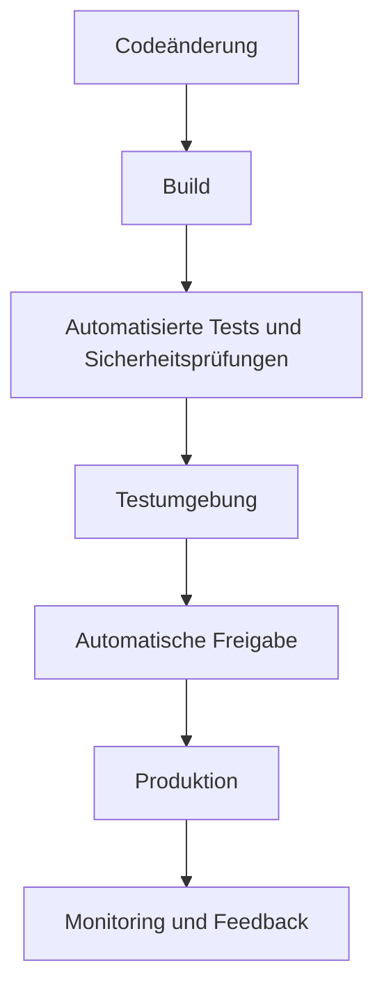
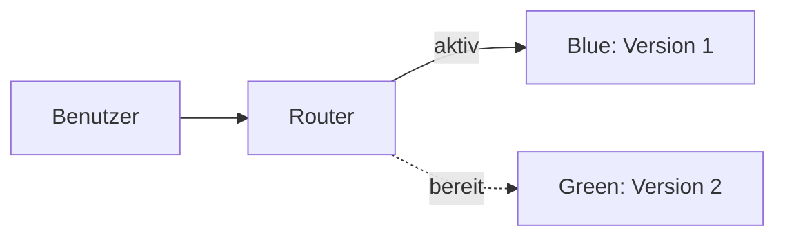
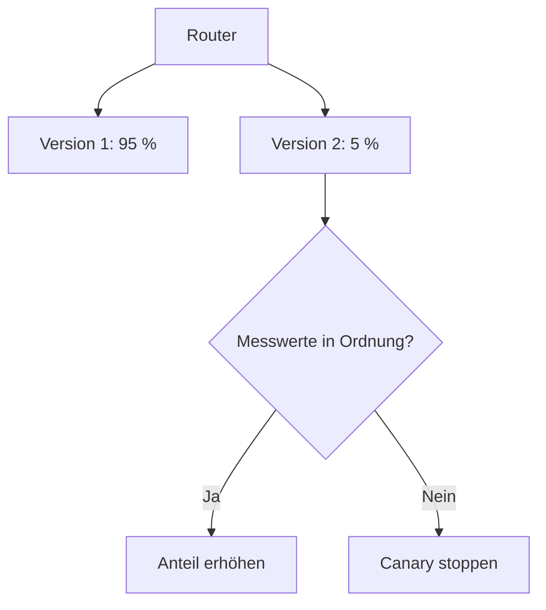
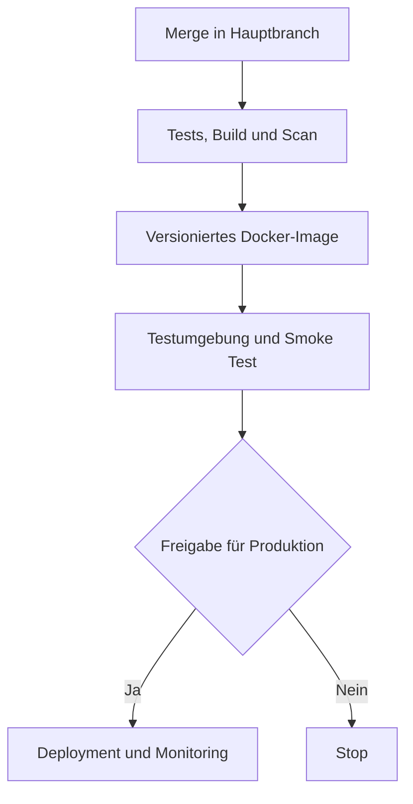

# Continuous Deployment

## 1. Überblick

Beim Deployment wird eine neue Softwareversion in eine Zielumgebung gebracht, zum Beispiel auf einen Testserver oder in die Produktion. **Produktion** ist die Umgebung, welche die echten Benutzer verwenden.

Continuous Deployment automatisiert diesen Weg bis in die Produktion. Das Ziel ist nicht, möglichst unkontrolliert zu veröffentlichen. Kleine Änderungen sollen vielmehr zuverlässig getestet, schrittweise bereitgestellt und laufend überwacht werden. Falls ein Fehler auftritt, muss die alte Version schnell wiederhergestellt werden können.

Dieser Auftrag behandelt:

- den Unterschied zwischen Continuous Delivery und Continuous Deployment,
- Blue/Green- und Canary-Deployments,
- A/B Testing, Feature Toggles, Rollback und Monitoring,
- den sicheren Umgang mit Passwörtern und anderen Secrets,
- mögliche technische Deployment-Varianten,
- eine begründete Empfehlung für die spätere Umsetzung in P4.

## 2. Continuous Deployment

### 2.1 Definition

**Continuous Deployment** bedeutet: Jede Codeänderung, die alle Prüfungen der Pipeline besteht, wird automatisch in die Produktion ausgerollt. Eine **Pipeline** ist eine automatisierte Abfolge von Schritten wie Bauen, Testen und Bereitstellen.

Der typische Ablauf sieht so aus:



Damit dies zuverlässig funktioniert, braucht es:

1. **Versionsverwaltung**, zum Beispiel Git. Jede Änderung ist nachvollziehbar.
2. **Automatische Builds**. Aus dem Quellcode entsteht ein ausführbares und eindeutig versioniertes Artefakt, zum Beispiel ein Docker-Image.
3. **Automatisierte Tests**, etwa Unit-, Integrations- und End-to-End-Tests.
4. **Sicherheitsprüfungen**, zum Beispiel das Scannen von Abhängigkeiten und Container-Images.
5. **Eine produktionsnahe Testumgebung**, auch Staging genannt.
6. **Automatisiertes Deployment** mit Health Checks. Ein Health Check prüft, ob die Anwendung erreichbar und funktionsfähig ist.
7. **Monitoring und eine getestete Rückkehrstrategie**, falls die neue Version Probleme verursacht.

Eine fehlgeschlagene Prüfung stoppt die Pipeline. Nur eine bestandene Änderung darf automatisch weiterlaufen.

**Quellen:** [AWS: Continuous Integration und Continuous Delivery/Deployment](https://docs.aws.amazon.com/whitepapers/latest/practicing-continuous-integration-continuous-delivery/what-is-continuous-integration-and-continuous-deliverydeployment.html), [Atlassian: Continuous Integration vs. Delivery vs. Deployment](https://www.atlassian.com/continuous-delivery/principles/continuous-integration-vs-delivery-vs-deployment), [Red Hat: Was ist CI/CD?](https://www.redhat.com/en/topics/devops/what-is-ci-cd)

### 2.2 Continuous Delivery und Continuous Deployment

Beide Ansätze automatisieren Build, Tests und die Vorbereitung einer veröffentlichbaren Version. Der entscheidende Unterschied liegt direkt vor dem Produktiv-Deployment:

| Frage | Continuous Delivery | Continuous Deployment |
|---|---|---|
| Ist jede bestandene Änderung produktionsbereit? | Ja | Ja |
| Erfolgt das Deployment in Testumgebungen automatisch? | Ja | Ja |
| Wer startet das Produktiv-Deployment? | Ein Mensch gibt es bewusst frei | Die Pipeline startet es automatisch |
| Typischer Einsatz | Hohe Risiken, Vorgaben oder gewünschtes Release-Fenster | Sehr gute Testabdeckung und häufige kleine Änderungen |

**Merksatz:** Delivery hält die Software jederzeit bereit. Deployment bringt jede bestandene Änderung automatisch live.

Der Begriff **CD** ist deshalb mehrdeutig. Er kann für beide Verfahren stehen und sollte in einer Dokumentation ausgeschrieben werden.

**Quellen:** [AWS: Continuous Delivery ist nicht Continuous Deployment](https://docs.aws.amazon.com/whitepapers/latest/practicing-continuous-integration-continuous-delivery/what-is-continuous-integration-and-continuous-deliverydeployment.html), [Atlassian: Vergleich der drei Continuous-Praktiken](https://www.atlassian.com/continuous-delivery/principles/continuous-integration-vs-delivery-vs-deployment), [Red Hat: CI/CD](https://www.redhat.com/en/topics/devops/what-is-ci-cd)

### 2.3 Vor- und Nachteile

| Ansatz | Vorteile | Nachteile und Voraussetzungen |
|---|---|---|
| **Continuous Delivery** | Kontrollierter Zeitpunkt; Freigaben lassen sich dokumentieren; geeignet bei rechtlichen oder geschäftlichen Vorgaben | Langsameres Feedback; Änderungen können sich vor der Freigabe sammeln; ein manueller Schritt bleibt |
| **Continuous Deployment** | Sehr schnelles Feedback; kleine und leichter überprüfbare Änderungen; kein grosser Release-Tag; weniger manuelle Routinearbeit | Fehler können automatisch live gehen; hohe Anforderungen an Tests, Monitoring und Rollback; Produkt, Support und Dokumentation müssen das Tempo mittragen |

Continuous Deployment ist nicht grundsätzlich besser. Die passende Wahl hängt von Risiko, Teamreife, Testqualität und Vorgaben ab. Bei einer Zahlungsanwendung kann eine manuelle Freigabe sinnvoll sein. Bei einer gut getesteten, weniger kritischen Webanwendung kann die automatische Veröffentlichung mehr Nutzen bringen.

**Quellen:** [Atlassian: Nutzen und Voraussetzungen](https://www.atlassian.com/continuous-delivery/principles/continuous-integration-vs-delivery-vs-deployment), [AWS: Rolle der Freigabeentscheidung](https://docs.aws.amazon.com/whitepapers/latest/practicing-continuous-integration-continuous-delivery/what-is-continuous-integration-and-continuous-deliverydeployment.html), [Red Hat: Automatisierungsgrad und Risikotoleranz](https://www.redhat.com/en/topics/devops/what-is-ci-cd)

## 3. Deployment-Strategien

Eine Deployment-Strategie bestimmt, **wie** die laufende alte Version durch eine neue Version ersetzt wird. Sie ist unabhängig davon, ob das Deployment manuell oder automatisch gestartet wird.

### 3.1 Blue/Green Deployment

Bei Blue/Green existieren zwei möglichst gleiche Produktionsumgebungen:

- **Blue** betreibt die aktuelle Version und erhält den Benutzerverkehr.
- **Green** erhält die neue Version und wird zuerst getestet.
- Danach schaltet ein Load Balancer oder Reverse Proxy den Verkehr von Blue auf Green um.
- Bei Problemen wird zurück auf Blue geschaltet.

Ein **Load Balancer** oder **Reverse Proxy** nimmt Anfragen entgegen und leitet sie an die gewählte Anwendungsumgebung weiter.



Nach einer erfolgreichen Umschaltung wird Green zur aktiven Umgebung. Blue bleibt für eine festgelegte Zeit als Rückfalloption bestehen.

**Vorteile:** kaum Unterbruch, klare Trennung der Versionen, sehr schneller technischer Rollback.  
**Nachteile:** zeitweise doppelte Infrastruktur, sorgfältige Synchronisation nötig, Datenbankänderungen können den Rückweg erschweren.

Blue/Green passt zu Systemen mit hohen Verfügbarkeitsanforderungen und genügend Ressourcen für zwei Umgebungen.

**Quellen:** [Martin Fowler: BlueGreenDeployment](https://martinfowler.com/bliki/BlueGreenDeployment.html), [HashiCorp Nomad: Blue/Green Deployments](https://developer.hashicorp.com/nomad/docs/job-declare/strategy/blue-green-canary), [IBM: Blue-Green Deployment](https://www.ibm.com/think/topics/blue-green-deployment)

### 3.2 Canary Deployment

Beim Canary Deployment erhält zunächst nur ein kleiner Anteil der Benutzer die neue Version. Der Name bezieht sich auf den früheren Einsatz von Kanarienvögeln als Frühwarnsystem im Bergbau.

Beispiel:

1. Version 2 erhält 5 % des Verkehrs, Version 1 weiterhin 95 %.
2. Fehlerrate, Antwortzeit und wichtige Geschäftswerte werden verglichen.
3. Sind die Werte stabil, wird der Anteil schrittweise erhöht, etwa auf 25 %, 50 % und 100 %.
4. Bei Problemen geht der gesamte Verkehr zurück auf Version 1.



**Vorteile:** Ein Fehler betrifft zuerst nur wenige Benutzer; die neue Version wird mit echtem Verkehr geprüft.  
**Nachteile:** Routing und Auswertung sind anspruchsvoller; zwei Versionen laufen gleichzeitig; Datenbank und Schnittstellen müssen mit beiden Versionen kompatibel sein.

Canary passt zu häufigen Releases, vielen Benutzern und einer guten Monitoring-Infrastruktur.

**Quellen:** [AWS: Canary Deployments](https://docs.aws.amazon.com/whitepapers/latest/overview-deployment-options/canary-deployments.html), [Martin Fowler: Canary Release](https://martinfowler.com/bliki/CanaryRelease.html), [HashiCorp Nomad: Canary Deployments](https://developer.hashicorp.com/nomad/docs/job-declare/strategy/blue-green-canary)

### 3.3 Blue/Green und Canary im Vergleich

| Kriterium | Blue/Green | Canary |
|---|---|---|
| Umschaltung | Meist auf einmal | Schrittweise |
| Betroffene Benutzer bei einem Fehler | Nach dem Wechsel potenziell alle | Anfangs nur die kleine Canary-Gruppe |
| Rollback | Verkehr zurück auf alte Umgebung | Neuen Anteil auf 0 % setzen |
| Ressourcen | Zwei vollständige Umgebungen | Alte und neue Version parallel, Umfang variabel |
| Komplexität | Vor allem Infrastruktur und Umschaltung | Vor allem Routing, Messwerte und automatische Grenzwerte |

AWS bezeichnet Canary als risikoärmere Form von Blue/Green. Andere Quellen beschreiben beide als getrennte Strategien. Das ist kein echter Widerspruch: Beide betreiben alte und neue Version parallel. Der praktische Unterschied ist, ob der Verkehr auf einmal oder schrittweise wechselt.

## 4. Ergänzende Verfahren

### 4.1 A/B Testing

**A/B Testing** ist ein kontrolliertes Experiment. Gruppe A sieht die bisherige Variante, Gruppe B eine neue Variante. Danach wird eine vorher festgelegte Kennzahl verglichen, zum Beispiel die Quote abgeschlossener Registrierungen.

Ein korrektes A/B Testing braucht:

- eine klare Hypothese, zum Beispiel: „Ein kürzeres Formular erhöht die Abschlussquote“;
- eine zufällige und während des Tests stabile Gruppenzuteilung;
- eine vorher festgelegte Erfolgskennzahl;
- genügend Daten, damit ein Unterschied nicht nur Zufall ist;
- Beachtung von Datenschutz und Einwilligung, wenn personenbezogene Daten betroffen sind.

**Abgrenzung:** Canary prüft hauptsächlich, ob eine neue Version technisch stabil ist. A/B Testing prüft, welche Variante ein Produktziel besser erreicht. Ein Feature Toggle kann die technische Umschaltung für beide Verfahren ermöglichen.

**Quellen:** [Microsoft Research: A/B Testing Across Products](https://www.microsoft.com/en-us/research/group/experimentation-platform-exp/articles/a-b-testing-across-products/), [Martin Fowler: A/B Testing mit Feature Toggles](https://martinfowler.com/articles/feature-toggles.html), [Microsoft Research: A/B Testing und Canary Flighting](https://www.microsoft.com/en-us/research/wp-content/uploads/2023/05/SEAA21-Flywheel_CR_Preprint.pdf)

### 4.2 Feature Toggles

Ein **Feature Toggle**, auch Feature Flag genannt, ist ein Schalter im Programm. Er aktiviert oder deaktiviert eine Funktion, ohne dass dafür neuer Code ausgerollt werden muss.

Beispiel:

```text
wenn "neue-suche" aktiviert ist:
    zeige die neue Suche
sonst:
    zeige die bisherige Suche
```

Typische Einsätze sind:

- unfertige Funktionen im ausgelieferten Code verborgen halten;
- eine Funktion zuerst für interne Tester oder wenige Benutzer aktivieren;
- A/B Tests durchführen;
- eine problematische Funktion als **Kill Switch** sofort ausschalten.

Feature Toggles trennen **Deployment** und **Release**: Der Code kann bereits produktiv installiert sein, obwohl die Funktion noch nicht für Benutzer freigegeben ist. Alte Toggles müssen nach ihrem Einsatz entfernt werden. Sonst entstehen zusätzliche Codepfade und damit mehr Test- und Wartungsaufwand.

**Quellen:** [Martin Fowler: Feature Toggles](https://martinfowler.com/articles/feature-toggles.html), [Unleash: Was ist ein Feature Flag?](https://docs.getunleash.io/get-started/what-is-a-feature-flag), [LaunchDarkly: Feature Flags](https://launchdarkly.com/blog/what-are-feature-flags/)

### 4.3 Rollback-Strategien

Ein **Rollback** stellt nach einem fehlerhaften Deployment einen vorher funktionierenden Zustand wieder her. Ein Rollback muss vor dem Ernstfall automatisiert und getestet sein.

| Strategie | Funktionsweise | Geeignet für |
|---|---|---|
| Vorheriges Artefakt erneut deployen | Die letzte bekannte, unveränderte Version wird aus der Registry installiert | Klassische Deployments und Container |
| Verkehr zurückschalten | Router zeigt wieder auf Blue beziehungsweise auf die alte Canary-Version | Blue/Green und Canary |
| Plattform-Rollback | Eine Plattform stellt eine frühere Revision wieder her, zum Beispiel `kubectl rollout undo` | Kubernetes und ähnliche Plattformen |
| Feature abschalten | Ein Toggle deaktiviert nur die problematische Funktion | Fehler, die klar einer Funktion zugeordnet sind |
| Roll-forward | Eine korrigierte neue Version wird ausgerollt | Wenn ein Rückweg technisch gefährlicher wäre |
| Daten wiederherstellen | Backup oder Snapshot wird eingespielt | Beschädigte Daten; nur mit getesteter Wiederherstellung |

Ein Code-Rollback löst nicht automatisch Datenbankprobleme. Datenbankmigrationen sollten deshalb zunächst **rückwärtskompatibel** sein: Erst neue Spalten hinzufügen, dann beide Versionen unterstützen und alte Strukturen erst in einem späteren Release entfernen. Dieses Vorgehen wird oft **Expand and Contract** genannt.

**Quellen:** [Kubernetes: Deployment-Rollback und Revisionen](https://kubernetes.io/docs/concepts/workloads/controllers/deployment/), [Kubernetes: Rolling Updates und Rollback](https://kubernetes.io/docs/tutorials/kubernetes-basics/update/update-intro/), [HashiCorp Nomad: Auto-Revert und Rollback](https://developer.hashicorp.com/nomad/docs/job-declare/strategy/blue-green-canary)

## 5. Continuous Monitoring

**Continuous Monitoring** bedeutet, dass Anwendung und Infrastruktur dauerhaft beobachtet werden. Es beginnt nicht erst nach einem Fehler, sondern gehört direkt zur Deployment-Pipeline.

Drei zentrale Arten von Beobachtungsdaten sind:

- **Metriken:** messbare Zahlen über die Zeit, zum Beispiel Fehlerrate, Antwortzeit, CPU- oder Speichernutzung;
- **Logs:** einzelne Ereignisse mit Zeitstempel, zum Beispiel eine fehlgeschlagene Anmeldung;
- **Traces:** der Weg einer Anfrage durch mehrere Dienste.

Für einen Webdienst sind die vier „Golden Signals“ besonders hilfreich: **Latenz** (Antwortdauer), **Traffic** (Last), **Fehler** und **Sättigung** (wie stark Ressourcen ausgelastet sind).

### Umsetzung

1. Die Anwendung liefert strukturierte Logs, Metriken und einen Health-Endpunkt.
2. Ein Werkzeug wie Prometheus sammelt die Metriken. Grafana kann sie darstellen.
3. Logs werden zentral gesammelt, zum Beispiel mit Loki oder Elastic Stack.
4. OpenTelemetry kann Metriken, Logs und Traces einheitlich erzeugen und weiterleiten.
5. Alarme werden an sinnvolle Grenzwerte gebunden, etwa „Fehlerrate über 5 % während fünf Minuten“.
6. Jedes Deployment erhält eine Markierung. Dadurch ist sichtbar, ob ein Fehler direkt nach einer neuen Version begonnen hat.
7. Kritische Grenzwerte können einen Canary automatisch stoppen oder einen Rollback auslösen.

Ein Alarm sollte eine konkrete Handlung auslösen. Zu viele bedeutungslose Warnungen führen dazu, dass echte Probleme übersehen werden.

**Quellen:** [Google SRE: Monitoring Distributed Systems](https://sre.google/sre-book/monitoring-distributed-systems/), [OpenTelemetry: Observability Primer](https://opentelemetry.io/docs/concepts/observability-primer/), [Prometheus: Overview](https://prometheus.io/docs/introduction/overview/)

## 6. Passwörter und Secrets sicher behandeln

Zuerst muss zwischen zwei Arten unterschieden werden:

### 6.1 Passwörter von Benutzern

Benutzerpasswörter dürfen weder im Klartext noch mit einer umkehrbaren Verschlüsselung gespeichert werden. Stattdessen wird ein langsamer **Passwort-Hash** gespeichert. Ein Hash ist ein Einweg-Prüfwert: Das System kann ein eingegebenes Passwort prüfen, muss das ursprüngliche Passwort aber nicht kennen.

OWASP empfiehlt Argon2id als erste Wahl. Jedes Passwort erhält zusätzlich einen zufälligen **Salt**. Dieser sorgt dafür, dass gleiche Passwörter unterschiedliche Hashes erzeugen. Gute Passwort-Bibliotheken erstellen und speichern den Salt automatisch zusammen mit dem Hash.

### 6.2 Technische Secrets

API-Schlüssel, Datenbankpasswörter, Tokens und Zertifikate werden **Secrets** genannt. Eine Anwendung muss sie verwenden können, deshalb werden sie nicht wie Benutzerpasswörter gehasht. Sie gehören in einen Secret Store, zum Beispiel Vault, Azure Key Vault, AWS Secrets Manager oder den geschützten Secret-Speicher der CI/CD-Plattform.

Wichtige Regeln:

- nie in Git, Quellcode, Dockerfile, Container-Image oder Logs speichern;
- nur zur Laufzeit bereitstellen;
- Zugriffsrechte nach dem Prinzip der kleinsten nötigen Berechtigung vergeben;
- Secrets regelmässig rotieren und Zugriffe protokollieren;
- für Cloud-Zugriffe möglichst kurzlebige Identitäten über OpenID Connect statt dauerhafter Schlüssel verwenden;
- versehentlich veröffentlichte Secrets sofort sperren und ersetzen. Das Löschen aus dem letzten Commit genügt nicht, weil sie in der Git-Historie bleiben können.

Kubernetes Secrets sind nicht automatisch gleichbedeutend mit vollständiger Sicherheit. Zugriffskontrolle und Verschlüsselung der gespeicherten Daten müssen passend konfiguriert werden.

**Quellen:** [OWASP: Password Storage Cheat Sheet](https://cheatsheetseries.owasp.org/cheatsheets/Password_Storage_Cheat_Sheet.html), [OWASP: Secrets Management Cheat Sheet](https://cheatsheetseries.owasp.org/cheatsheets/Secrets_Management_Cheat_Sheet.html), [GitHub: Secrets in Actions](https://docs.github.com/en/actions/how-tos/write-workflows/choose-what-workflows-do/use-secrets), [GitHub: OpenID Connect](https://docs.github.com/en/actions/concepts/security/openid-connect), [Kubernetes: Good Practices for Secrets](https://kubernetes.io/docs/concepts/security/secrets-good-practices/)

## 7. Technische Deployment-Varianten

„Deployment-Art“ kann zwei Dinge meinen:

1. **Betriebsform:** Wo und womit läuft die Anwendung?
2. **Einführungsstrategie:** Wie ersetzt die neue Version die alte?

Blue/Green und Canary gehören zur zweiten Frage. Die folgende Tabelle zeigt wichtige Betriebsformen:

| Variante | Umsetzung | Benötigte Software oder Umgebung | Typischer Einsatz |
|---|---|---|---|
| Direkt aus Quellcode auf Server | Repository holen, Abhängigkeiten installieren, auf dem Server bauen und Prozess neu starten | Linux/Windows-Server, Git, Compiler oder Runtime, Service Manager wie systemd | Kleine interne Projekte; einfach, aber schlecht reproduzierbar |
| Fertiges Artefakt auf Server | In CI bauen, versioniertes Paket oder Binary übertragen und Dienst neu starten | CI-System, Artefakt-Repository, Server, SSH/Ansible, Runtime falls nötig | Klassische Anwendungen ohne Container |
| Einzelner Docker-Container | Image in CI bauen, in Registry ablegen und auf einem Host starten | Docker Engine, Container Registry, Linux-Server | Ein einzelner Dienst oder kleiner Prototyp |
| Docker Compose | Mehrere Container als Datei definieren und gemeinsam starten | Docker Engine mit Compose, Registry, ein Server | Kleine Webanwendungen mit App, Datenbank und Proxy |
| Docker Swarm | Container als verteilten Stack auf mehreren Hosts ausrollen | Mehrere Docker-Hosts, Swarm-Modus, Registry | Einfachere Container-Orchestrierung |
| Kubernetes | Gewünschten Zustand deklarieren; Controller führt Rolling Updates und Selbstheilung aus | Kubernetes-Cluster, `kubectl`, Registry; optional Helm und Ingress | Viele Dienste, Skalierung und hohe Verfügbarkeit |
| Virtuelle Maschine oder unveränderliches Image | Neues VM-Image erstellen und alte Instanzen ersetzen | Hypervisor oder Cloud, Image Builder, Load Balancer, IaC wie Terraform | Starke Isolation und reproduzierbare Server |
| Platform as a Service | Code oder Container hochladen; Plattform verwaltet Betriebssystem und Skalierung | Anbieter wie Azure App Service, Cloud Foundry, Render oder Heroku | Wenig Betriebsaufwand, schnelle Umsetzung |
| Serverless Function | Funktion als Paket oder Container veröffentlichen; Anbieter startet sie bei Bedarf | AWS Lambda, Azure Functions oder Google Cloud Functions | Ereignisgesteuerte, kurze Aufgaben und APIs |
| Statische Website über CDN | Gebaute HTML-, CSS- und JS-Dateien weltweit verteilen | Static Host wie GitHub Pages, Cloudflare Pages oder Object Storage plus CDN | Frontends ohne eigenen Serverprozess |

Weitere Einführungsstrategien sind:

- **Recreate:** Alte Version stoppen, danach neue starten. Einfach, aber mit Unterbruch.
- **Rolling Update:** Instanzen nacheinander ersetzen. Spart Ressourcen, beide Versionen laufen vorübergehend parallel.
- **Blue/Green:** Zwei Umgebungen und ein gezielter Wechsel.
- **Canary:** Verkehr schrittweise auf die neue Version verschieben.

**Quellen:** [Docker: Compose in Produktion](https://docs.docker.com/compose/how-tos/production/), [Docker: Stack auf Swarm deployen](https://docs.docker.com/engine/swarm/stack-deploy/), [Kubernetes: Deployments](https://kubernetes.io/docs/concepts/workloads/controllers/deployment/), [Microsoft: Azure App Service Deployment Practices](https://learn.microsoft.com/en-us/azure/app-service/deploy-best-practices), [AWS: Lambda Deployment Packages](https://docs.aws.amazon.com/lambda/latest/dg/configuration-function-zip.html), [Ansible: Playbooks](https://docs.ansible.com/ansible/latest/playbook_guide/playbooks_intro.html), [GitHub: About GitHub Pages](https://docs.github.com/en/pages/getting-started-with-github-pages/about-github-pages)

## 8. Auswahl anhand von Anforderungen und Risiken

| Projektanforderung | Sinnvolle Wahl | Begründung |
|---|---|---|
| Kurzer Unterbruch ist erlaubt, kleines Team | Recreate mit Docker Compose | Geringe Komplexität und tiefe Kosten |
| Kein Unterbruch, schneller Rückweg | Blue/Green | Umschaltung und Rückschaltung sind schnell |
| Fehler dürfen nur wenige Benutzer treffen | Canary | Kleine anfängliche Auswirkung |
| Viele Instanzen, aber keine doppelte Umgebung | Rolling Update | Instanzen werden schrittweise ersetzt |
| Gesetzliche Freigabe oder schwache Testabdeckung | Continuous Delivery | Ein Mensch kontrolliert den letzten Schritt |
| Reife Tests, kleine Änderungen, starkes Monitoring | Continuous Deployment | Schnelles Feedback bei kontrolliertem Risiko |
| Stark schwankende, ereignisbasierte Last | Serverless oder skalierbares PaaS | Plattform passt Ressourcen automatisch an |

Die Entscheidung darf nicht nur auf Geschwindigkeit beruhen. Wichtig sind auch Ausfallkosten, Datenverlust, Testabdeckung, Datenbankänderungen, verfügbare Infrastruktur und Erfahrung des Teams.

## 9. Transfer auf P4

Da die genaue Infrastruktur von P4 hier nicht beschrieben ist, nehme ich eine kleine Webanwendung, Git und einen Linux-Server an. Dafür ist folgende Lösung realistisch und nicht unnötig komplex:

### Empfohlener Start

- **Continuous Delivery statt sofort Continuous Deployment.** Jeder Merge in den Hauptbranch wird gebaut, getestet und auf eine Testumgebung ausgerollt. Produktion benötigt zunächst eine manuelle Freigabe.
- **Docker Compose auf einem Server.** Die Anwendung wird als Docker-Image gebaut. Jedes Image erhält den unveränderlichen Tag der Commit-ID, zum Beispiel `app:a1b2c3d`. Der Tag `latest` eignet sich nicht als zuverlässige Rollback-Version.
- **Automatisierte Pipeline**, zum Beispiel mit GitHub Actions oder GitLab CI: Code prüfen, Tests ausführen, Image scannen, Image bauen, in Registry laden, Testumgebung deployen, Smoke Test ausführen, Produktionsfreigabe abwarten und danach deployen.
- **Rollback:** Die vorherige Image-Version bleibt bekannt. Bei einem Fehler wird genau dieser Tag erneut gestartet. Bei genügend Serverkapazität kann später ein einfacher Blue/Green-Aufbau mit zwei Compose-Projekten und Nginx als Reverse Proxy ergänzt werden.
- **Monitoring:** Health Check, Erreichbarkeit, Fehlerrate, Antwortzeit sowie CPU-, RAM- und Speicherverbrauch überwachen. Logs zentral oder mindestens dauerhaft ausserhalb des Containers speichern.
- **Secrets:** Deployment-Zugang im Secret-Speicher der CI-Plattform ablegen. Anwendungs-Secrets nur auf dem Server oder in einem Secret Store speichern, niemals im Repository.
- **Datenbank:** Vor jedem riskanten Schemawechsel Backup und Wiederherstellung testen. Migrationen so gestalten, dass alte und neue Anwendung vorübergehend mit demselben Schema funktionieren.



### Wann auf Continuous Deployment wechseln?

Der manuelle Schritt kann entfernt werden, sobald diese Bedingungen erfüllt sind:

- alle wichtigen Tests laufen zuverlässig automatisch;
- die Testumgebung entspricht der Produktion ausreichend;
- Rollback und Datenbank-Wiederherstellung wurden getestet;
- Monitoring erkennt Fehler rasch und löst brauchbare Alarme aus;
- kleine Änderungen werden einzeln veröffentlicht;
- das Team weiss, wer auf einen Alarm reagiert.

A/B Testing ist für P4 nur sinnvoll, wenn es genügend echte Benutzer und eine messbare Produktfrage gibt. Feature Toggles sind bereits bei wenigen Benutzern nützlich, etwa um eine riskante neue Funktion unabhängig vom Deployment ein- oder auszuschalten.

## 10. Fazit

- Continuous Delivery hält jede bestandene Änderung produktionsbereit; Continuous Deployment veröffentlicht sie automatisch.
- Blue/Green ermöglicht eine schnelle Umschaltung zwischen zwei Umgebungen. Canary begrenzt das Risiko durch einen schrittweisen Rollout.
- A/B Testing misst den Nutzen einer Variante. Feature Toggles steuern Funktionen unabhängig vom Deployment.
- Ein sicheres Deployment braucht von Anfang an Rollback, Monitoring und einen sauberen Umgang mit Secrets.
- Für P4 ist ein einfacher, nachvollziehbarer Aufbau besser als eine unnötig grosse Plattform. Continuous Delivery mit versionierten Docker-Images und getestetem Rollback ist ein sinnvoller Start. Continuous Deployment ist der nächste Schritt, sobald die Schutzmechanismen zuverlässig funktionieren.

## 11. Lernzielkontrolle

| Lernziel | Woran erkennt man, dass es erreicht ist? |
|---|---|
| Delivery und Deployment unterscheiden | Die manuelle beziehungsweise automatische Produktionsfreigabe korrekt erklären |
| Blue/Green und Canary vergleichen | Umschaltung, Risiko, Ressourcenbedarf und Rollback gegenüberstellen |
| A/B, Toggles, Rollback und Monitoring einordnen | Produkt-Experiment, Funktionssteuerung, Wiederherstellung und Betriebsbeobachtung auseinanderhalten |
| Secrets und Passwörter sicher behandeln | Passwort-Hashing von Secret Management unterscheiden und typische Fehler vermeiden |
| Deployment-Varianten beurteilen | Eine Variante anhand von Risiko, Verfügbarkeit, Kosten und Komplexität begründen |
| Theorie auf P4 übertragen | Eine realistische Pipeline samt Deployment, Rollback, Monitoring und Secrets beschreiben |

## 12. Quellenverzeichnis

Alle Quellen wurden zuletzt am **7. September 2026** geprüft.

1. [AWS: Practicing Continuous Integration and Continuous Delivery](https://docs.aws.amazon.com/whitepapers/latest/practicing-continuous-integration-continuous-delivery/what-is-continuous-integration-and-continuous-deliverydeployment.html)
2. [Atlassian: Continuous Integration vs. Delivery vs. Deployment](https://www.atlassian.com/continuous-delivery/principles/continuous-integration-vs-delivery-vs-deployment)
3. [Red Hat: What is CI/CD?](https://www.redhat.com/en/topics/devops/what-is-ci-cd)
4. [Martin Fowler: BlueGreenDeployment](https://martinfowler.com/bliki/BlueGreenDeployment.html)
5. [Martin Fowler: CanaryRelease](https://martinfowler.com/bliki/CanaryRelease.html)
6. [AWS: Canary Deployments](https://docs.aws.amazon.com/whitepapers/latest/overview-deployment-options/canary-deployments.html)
7. [HashiCorp Nomad: Blue/Green and Canary Deployments](https://developer.hashicorp.com/nomad/docs/job-declare/strategy/blue-green-canary)
8. [Microsoft Research: A/B Testing Across Products](https://www.microsoft.com/en-us/research/group/experimentation-platform-exp/articles/a-b-testing-across-products/)
9. [Martin Fowler: Feature Toggles](https://martinfowler.com/articles/feature-toggles.html)
10. [Kubernetes: Deployments](https://kubernetes.io/docs/concepts/workloads/controllers/deployment/)
11. [Google SRE: Monitoring Distributed Systems](https://sre.google/sre-book/monitoring-distributed-systems/)
12. [OpenTelemetry: Observability Primer](https://opentelemetry.io/docs/concepts/observability-primer/)
13. [Prometheus: Overview](https://prometheus.io/docs/introduction/overview/)
14. [OWASP: Password Storage Cheat Sheet](https://cheatsheetseries.owasp.org/cheatsheets/Password_Storage_Cheat_Sheet.html)
15. [OWASP: Secrets Management Cheat Sheet](https://cheatsheetseries.owasp.org/cheatsheets/Secrets_Management_Cheat_Sheet.html)
16. [GitHub Docs: Using Secrets in GitHub Actions](https://docs.github.com/en/actions/how-tos/write-workflows/choose-what-workflows-do/use-secrets)
17. [Docker Docs: Use Compose in Production](https://docs.docker.com/compose/how-tos/production/)
18. [Docker Docs: Deploy a Stack to a Swarm](https://docs.docker.com/engine/swarm/stack-deploy/)
19. [Microsoft Learn: Azure App Service Deployment Best Practices](https://learn.microsoft.com/en-us/azure/app-service/deploy-best-practices)
20. [AWS Lambda: Deployment Packages](https://docs.aws.amazon.com/lambda/latest/dg/configuration-function-zip.html)
21. [IBM: Blue-Green Deployment](https://www.ibm.com/think/topics/blue-green-deployment)
22. [Microsoft Research: A/B Testing und Canary Flighting](https://www.microsoft.com/en-us/research/wp-content/uploads/2023/05/SEAA21-Flywheel_CR_Preprint.pdf)
23. [Unleash: What is a Feature Flag?](https://docs.getunleash.io/get-started/what-is-a-feature-flag)
24. [LaunchDarkly: What are Feature Flags?](https://launchdarkly.com/blog/what-are-feature-flags/)
25. [GitHub Docs: OpenID Connect](https://docs.github.com/en/actions/concepts/security/openid-connect)
26. [Kubernetes: Good Practices for Secrets](https://kubernetes.io/docs/concepts/security/secrets-good-practices/)
27. [Ansible: Playbooks](https://docs.ansible.com/ansible/latest/playbook_guide/playbooks_intro.html)
28. [GitHub Docs: About GitHub Pages](https://docs.github.com/en/pages/getting-started-with-github-pages/about-github-pages)
